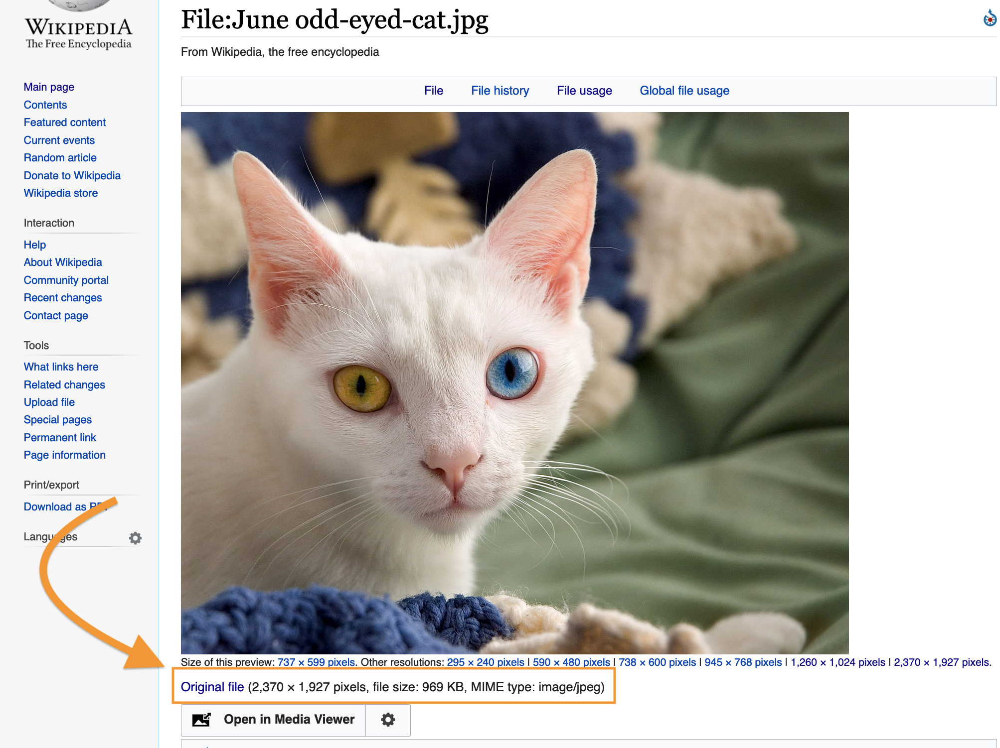

This page and the following two will explain how you can use [TimelineJS](http://timeline.knightlab.com/), an open-source tool for creating interactive timelines, to build your own narratives about Thoreau’s revisions to *Walden*. First, we’ll introduce the tool, and you’ll practice using it by building a simple timeline based on some of what you’ve read in Gleick’s *The Information*. Next, you’ll learn how to work with the images in the Huntington Library’s digitized *Walden* manuscript. Finally, you’ll learn how to bring those images into a timeline that tells a story about a particular revision.

## What is TimelineJS?

TimelineJS is an open-source application written in the JavaScript programming language. It was created and is maintained by [Knight Lab](https://knightlab.northwestern.edu), a community of designers, developers, students, and educators at Northwestern University who work to produce innovative digital tools for journalists.

As with many projects of this type, the developers of TimelineJS use Git to manage their collaborative workflow and [store their code on GitHub](https://github.com/NUKnightLab/TimelineJS3).

## How do I start building a timeline using TimelineJS?

The TimlineJS website provides excellent instructions for using the tool. In brief, the workflow is as follows:

1.  Use the link on the TimelineJS website to get a copy of their Google sheet template
2.  Follow the instructions to “publish your spreadsheet to the web.”
3.  Carefully follow the instructions to copy the URL *in your browser’s address bar* near the top of your browser window.
4.  Paste the URL into the box next to “Generate your timeline.” Click “Preview” to see the timeline.

You can also grab the URL in the box next to “Share your timeline,” open a new browser tab or window, and pop the URL in there. Now every time you update your spreadsheet, you can just refresh the page and you’ll see your changes take effect.

## What next?

Study the spreadsheet to see how the information in it generates the timeline. The template contains sample dates, images, and text that you can replace with your own content. To get a feel for how changing the contents of a cell in the spreadsheet will change the generated timeline, find an image on Wikipedia and substitute the URL for that image for one of the URLs in the “Media” column.

Note that the images in a TimelineJS timeline are all pulled from locations on the web. There’s no way to “upload an image” to your timeline from, say, your computer’s hard drive.

One challenge to pulling in an image by its URL is that the URL must actually point to *the image file itself*, not to a page generated by, say, Google that merely *contains* the image.

For example, if I google “cat” and then click “Images” below the search box, I get a lot of image thumbnails as my result. If I click on the thumbnail for an image of a “June odd-eyed cat,” available through Wikipedia, I’m taken to a page that shows a larger version of the image to the right of the thumbnails.

The page has a very long address:

<https://www.google.com/search?q=cat&tbm=isch&hl=en&hl=en&tbs=sur%3Afc&ved=0CAIQpwVqFwoTCMDl6ObvougCFQAAAAAdAAAAABAH&biw=1440&bih=803#imgrc=V7Y4e4Rnz-clTM>

But notice that the address doesn’t end with one of the typical file extensions for an image, such as `.jpg`, `.png`, or `.gif`. This address won’t work in TimelineJS because it’s not actually pointing to an image file. Instead, it’s pointing to a search results page.

Clicking the image in that search results page takes me here:

<https://en.wikipedia.org/wiki/File:June_odd-eyed-cat.jpg>

This looks better – the URL ends with `.jpg` — but careful! This URL still isn’t pointing to the image file itself but to a Wikipedia page *about* the file.

However, if I look beneath the image on the Wikipedia page, I see a link to the “Original file.”

Clicking that link takes me here:

<https://upload.wikimedia.org/wikipedia/commons/a/a3/June_odd-eyed-cat.jpg>

Perfect! This will work.
